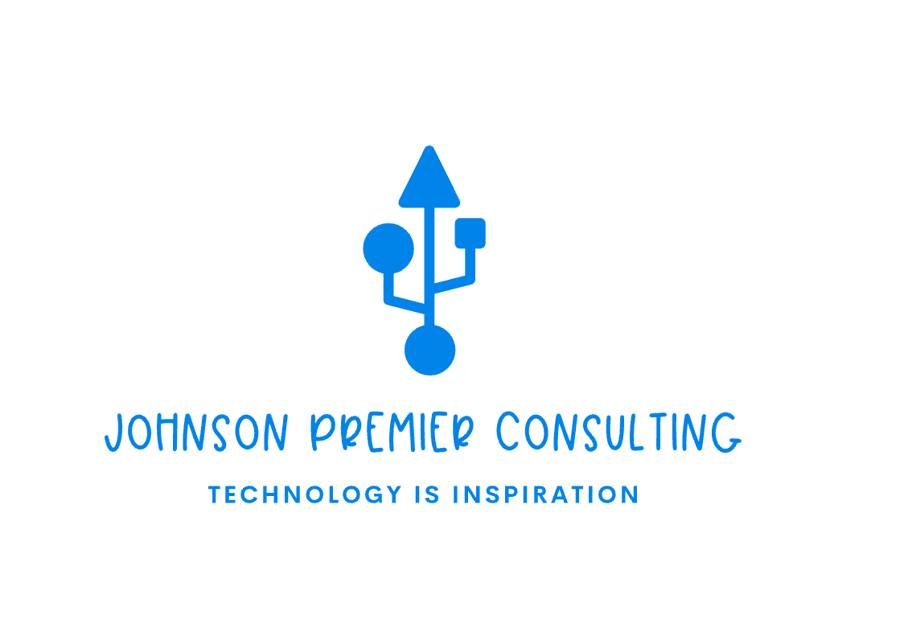

# Johnson Premier Consulting

Welcome to Johnson Premier Consulting, LLC, where we specialize in providing top-tier IT support services tailored to meet the unique needs of your business. With nearly 15 years of experience in government support and system administration, we bring a wealth of expertise to ensure your IT infrastructure is robust, secure, and efficiently managed, allowing you to focus on what you do best.

## Services

We offer a comprehensive suite of IT support services designed to meet the unique needs of your business. Our expertise spans secure network infrastructure management, VPN and remote service administration, and advanced user support for complex IT issues. We manage both Linux and Windows server environments, ensuring robust system performance and security. Additionally, we provide vendor coordination, data backup solutions, and meticulous documentation of all processes. With nearly 15 years of industry experience, we are equipped to handle everything from troubleshooting and system hardening to virtualization with VMware vSphere and Proxmox. Whether you require ongoing IT support, project-based assistance, or specialized consulting, our goal is to deliver tailored, high-quality IT solutions that enhance your operational efficiency and security.

### Network Infrastructure Management
### Vendor and Collaboration Services
### Remote and On-Site Support
### Data Backup and Documentation
### Project Reporting and Training

 

## Contact

email: info@johnsonpremier.com

phone: 240-412-2886

Thank you for your interest in Johnson Premier Consulting, LLC. Whether you have questions about our IT support services, need assistance with a project, or want to explore collaboration opportunities, we’re here to help. Feel free to reach out to us using the contact information provided above. Our dedicated team is committed to providing timely responses and expert guidance tailored to meet your specific needs. We look forward to hearing from you and discussing how we can support your business with our comprehensive IT solutions.

 

We invite you to complete our [Google Form](https://forms.gle/z9yjMERyy33tNsQo7) for any inquiries or to get in touch with us.

You may visit my [Personal Portfolio](https://jamisonjohnson.me) for more information about him.

You may visit my [Personal Blog](https://jamisonjohnson.me/blog/) for more tech news and informational documentation.